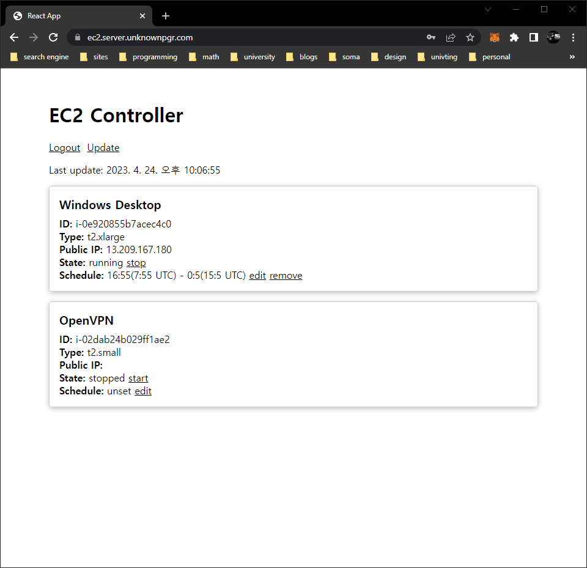

# EC2 Scheduler



군대에서 개발을 진행하기 위해 개발 환경을 Windows 2019 `t2.large` EC2 인스턴스 위에 구성하였습니다. 그런데 이 인스턴스를 항상 켜놓다 보니 비용이 꽤 들었습니다. 그래서 이번에 개발환경 사양을 올리면서 인스턴스를 자동으로 켜고 꺼주는 스케줄러를 만들기로 했습니다.

원래는 그런 기능을 가지는 python 스크립트를 작성하였습니다. 그러나 생각보다 예상치 못한 시간에 인스턴스를 켜거나 끄는 일이 많았습니다. 그래서 스케줄 설정 및 필요한 경우 직접 인스턴스를 켜고 끄는 기능을 가진 웹 어플리케이션으로 마이그레이션하기로 결정했습니다.

## Usage

1. 인스턴스를 생성합니다.
2. 다음과 같은 권한을 가진 IAM 계정을 만듭니다.

   ```json
   {
     "Version": "2012-10-17",
     "Statement": [
       {
         "Effect": "Allow",
         "Action": ["ec2:StartInstances", "ec2:StopInstances"],
         "Resource": "arn:aws:ec2:*:*:instance/*"
       },
       {
         "Effect": "Allow",
         "Action": "ec2:DescribeInstances",
         "Resource": "*"
       }
     ]
   }
   ```

3. 도커 이미지를 빌드합니다.

   ```bash
   docker build -t ec2-scheduler .
   ```

4. 아래와 같은 `.env`파일을 생성한 후 IAM 계정의 `AWS_ACCESS_KEY_ID`와 `AWS_SECRET_ACCESS_KEY`를 입력합니다.
   ```bash
   AWS_REGION=
   AWS_ACCESS_KEY_ID=
   AWS_SECRET_ACCESS_KEY=
   WEBUI_PASSWORD= # 웹 UI에 접속할 때 사용할 비밀번호
   ```
5. 아래와 같이 컨테이너를 실행합니다.

   ```bash
   docker run -d -p 80:80 -v /path/to/.env:/app/.env ec2-scheduler
   ```

환경 변수는 커맨드라인 인자로 넘겨줄 수도 있습니다.
